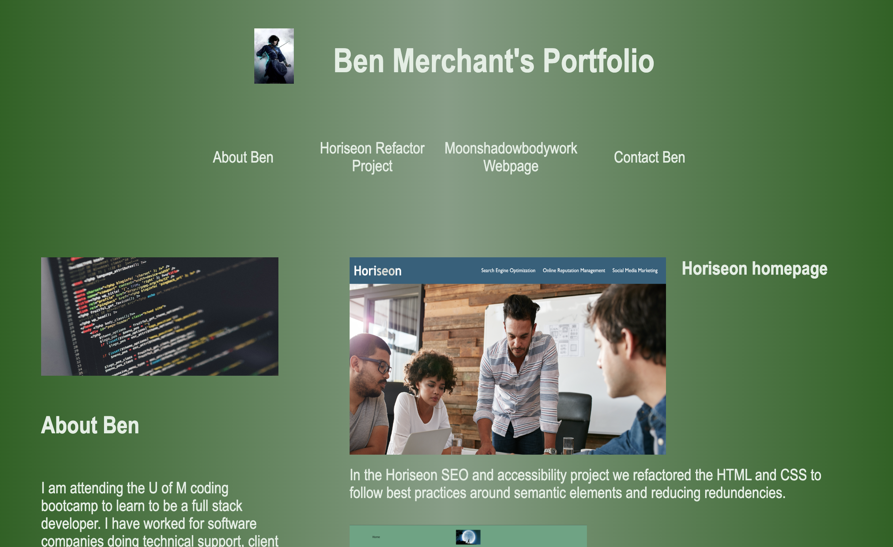

# Portfolio
This is the homepage for my portfolio.

For this assignment, I created the HTML and CSS from scratch. I created a site that shows the projects I've worked on. I added an avatar, links to areas of the page, and used a responsive design so it looks good on any device. 

The following image shows the web application:

## Link to Deployed Version
[Click here to see the deployed version](https://jengelfling.github.io/portfolio/)